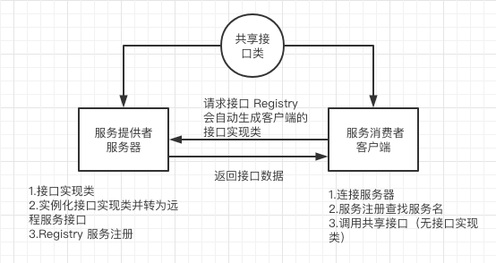
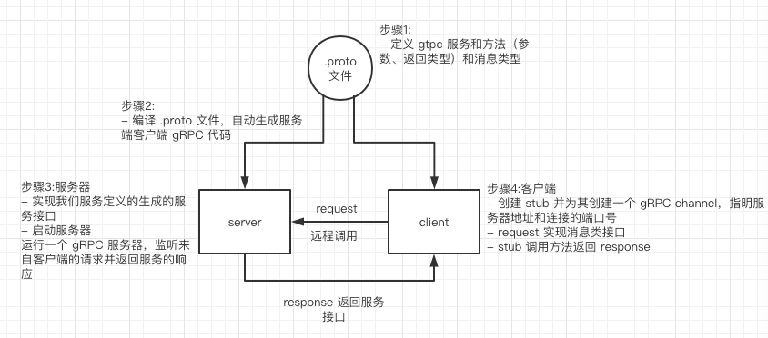

# RPC 和 gRPC 使用介绍
通过文章可以了解 RPC 和 gRPC 是什么。以及如何实现如何测试，还有 demo 代码库进行上手体验。

## RPC 是什么

远程过程调用 Remote Procedure Call，它不是一种协议，是一种实现方式。

## RPCP 协议

RPCP 协议是代码通过网络可以调用远程的计算机程序上的请求服务，而不需要了解底层网络技术的协议。

由于是通过网络传输数据，数据通过序列化和反序列化传输，还涉及代码相关的二进制字节码，容易造成安全漏洞，所以一般在内网互相信任的机器间通信。

## Java 中实现远程调用

RMI 是 Remote Method Invocation 的缩写，远程方法调用。Java 的 RMI 远程调用是指，一个 JVM 中的代码可以通过网络实现远程调用另一个 JVM 的某个方法。

(rpc 实现流程)

### 实现原理

对客户端来说，客户端持有的某个接口实际上对应了一个“实现类”，它是由 Registry 内部动态生成的，并负责把方法调用通过网络传递到服务器端。

而服务器端接收网络调用的服务并不是我们自己编写的接口实现类，而是 Registry 自动生成的代码。

我们把客户端的“实现类”称为 stub，而服务器端的网络服务类称为 skeleton，它会真正调用服务器端的接口实现类，获取结果，然后把结果通过网络传递给客户端。

### 实现过程

客户端会调用进程发送一个有进程参数的调用信息到服务进程，然后等待应答信息。

在服务器端，调用信息到达时，服务器获得进程参数，接口实现类返回结果信息给客户端。

- 服务器端：提供服务      
    步骤：
    1. 共享接口类
    2. 接口实现类
    3. 实例化接口实现类并转为远程服务接口
    4. Registry 服务注册

- 客户端：实现远程调用，请求程序获得返回值是通过网络从服务器端获取的
    步骤：  
    1. 共享接口类(和服务器同一个工程则相同文件）    
    2. 连接服务器   
    3. 在服务注册中查找服务名   
    4. 调用共享的接口（没有接口实现类） 

### 实现架构

RPC 接口一般按照分层的方式来架构，使用这种方式可以使各层之间解耦合（最大限度松耦合）。

服务提供者：Provider

服务消费者：Consumer

服务注册（发现）中心：Registry 

同级服务的调用次数和调用时间的日志服务：Monitor

## RPC 接口测试（todo:完善）
1. 接口调用的客户端依赖包（开发提供）。
2. 配置接口远程服务端的服务提供者和服务消费者。
3. 先配置消费者调用请求信息：接口（interface）的全路径、协议（PRC）、实例名称、超时时间等信息.
4. 注入接口实例后再调用接口并传入参数，验证方法返回值情况。

## gRPC

由 google 开发，可以使用不同语言进行 RPC 调用的系统。

### 为什么使用 gRPC

使用 .proto 文件一次定义服务，指定其能够被远程调用的方法（包含参数和返回类型），以 gRPC 支持的任何语言生成客户端和服务器。

- protol 协议

gRPC 默认使用 protocol buffers，这是 Google 开源的一套成熟的结构数据序列化机制（当然也可以使用其他数据格式如 JSON）。用 proto files 创建 gRPC 服务，用 protocol buffers 消息类型来定义方法参数和返回类型。

### Java 实现例子

(grpc 实现流程)

demo https://github.com/iiFeng/grpc-demo

1. 定义服务

编写 proto：使用 protocol buffers 接口定义语言来定义服务方法，用 protocol buffer 来定义参数和返回类型。客户端和服务端均使用服务定义生成的接口代码。

- 如例子中 Greeter 服务有一个方法 SayHello ，可以让服务端从远程客户端接收一个包含用户名的 HelloRequest 消息后，在一个 HelloReply 里发送回一个 Greeter。Message 消息类型对象

2. 自动生成客户端和服务器端代码

生成 gRPC 代码：使用 protocol buffer 编译器 protoc 来生成创建应用所需的特定客户端和服务端的代码（编译器为每一个消息类型生成了一个.java文件，以及一个特殊的Builder类（该类是用来创建消息类接口）。

- 例子中自动生成的类：序列化以及获取请求和应答的消息类型的类，和 GreeterGrpc.java文件里服务器要实现的一个接口，接口里还有服务定义的方法。
- 客户端可以用来和服务器交互的 stub 类。

3. 创建并启动服务器

- 实现我们服务定义的生成的服务接口：做我们的服务的实际的“工作”。
- 实现 gRPC 的 `io.grpc.stub.StreamObserver`接口，接口有三个方法。onNext:表示接收/发送一个对象，onCompleted:表示 Request 或 Response 结束，onError:处理异常。
- 运行一个 gRPC 服务器，监听来自客户端的请求并返回服务的响应。使用生成器的 forPort() 方法指定地址以及期望客户端请求监听的端口。用生成器注册我们的服务实现到生成器的 addService() 方法。调用生成器上的 build() 和 start() 方法为我们的服务创建和启动一个 RPC 服务器。

4. 创建客户端

- 创建 stub，为了调用服务方法，可以定义同步还是异步的 stub 方式。
- 创建一个 gRPC channel，指明服务器地址和我们想连接的端口号
- 调用服务方法，我们创建和填充了一个请求 protocol buffer 对象，在我们的 stub 上将其传给方法
- Channel的初始化过程：调用forTarget方法创建`io.grpc.ManagedChannelBuilder`;配置各种选项，不论如何配置，返回的总是`io.grpc.ManagedChannelBuilder`对象;调用build方法创建`io.grpc.ManagedChannel`。       

### gRPC 如何进行测试（todo:完善）
- 服务端        
    步骤：
    1. 生成进程名，创建服务，并注册接口实现类        
    2. 创建客户端通道并注册进程服务名
    3. 桩调用接口实现类的方法
    4. 验证返回的值
- 客户端        
    步骤：
    1. 使用 mock 创建接口实现类对象      
    2. 初始化：生成进程名，创建服务，并注册接口实现类，创建客户端通道并注册进程名      
    3. 调用客户端的方法，发送请求
    4. 验证请求行为        
- 用例设计还需要考虑多种情况进行        
如：参数类型情况、RPC 调用时产生的远程服务超时情况