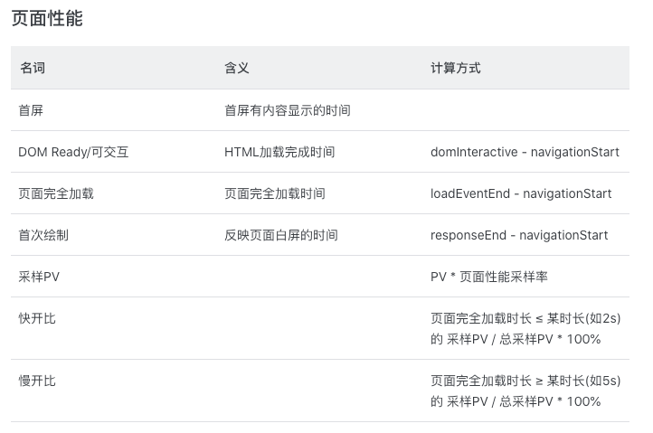
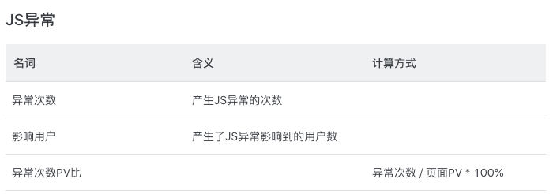
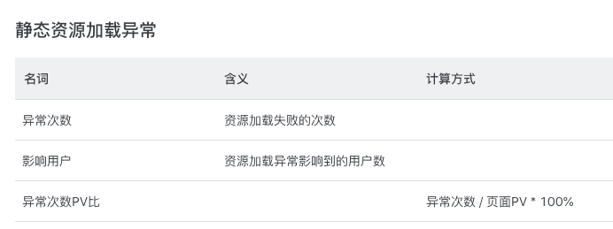
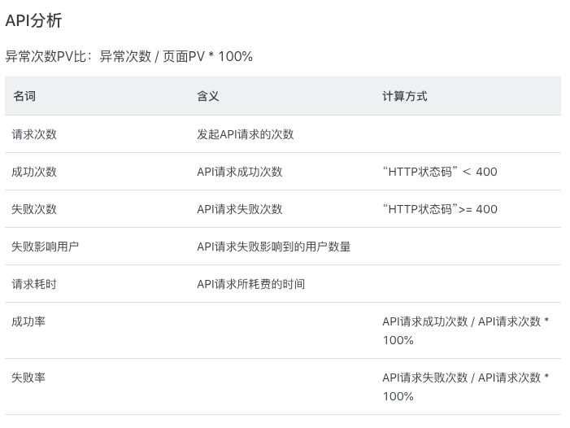
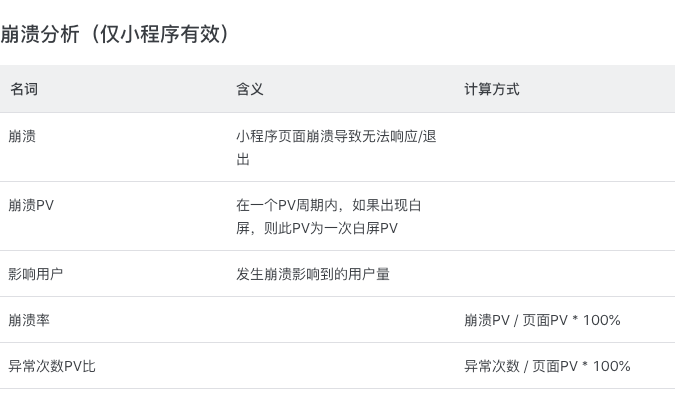
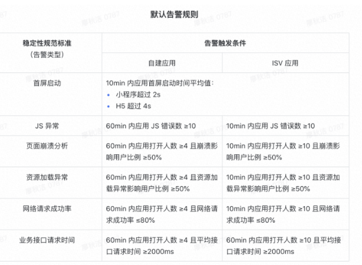

# 飞书应用的测试 <!-- {docsify-ignore} -->
本文是基于飞书开放平台的文档进行信息归纳，可以了解到飞书应用（也称为小程序）开发流程和自动化测试的过程。        

通过小程序开发平台提供丰富的 API 了解到程序是如何实现功能。平台除了提供小程序框架，包括从应用的入口到设计的逻辑、生命周期的 5 种状态、事件组件绑定；还提供自动化测试框架；还提供了应用监控。                  

文中从开发角度、测试角度、监控角度了解程序，对应用实现有更深的了解。引发思考，要如何测试平时使用飞书的应用？        

## 开发角度：小程序框架提供的开发能力
1. 逻辑层、视图层方面与 Node.js 提供的 MVVM 框架差不多，此处不表。
2. 场景值：场景值描述了用户打开小程序的路径入口，从应用的入口了解应用被使用的场景
-  应用常见的场景使用应用入口
    ```jsx
    从应用中心主入口
    从会话列表的列表项打开
    从全局搜索里搜出的结果卡片打开
    从单人聊天会话中小程序消息卡片打开
    从多人聊天会话中小程序消息卡片打开
    从单人聊天会话里消息中链接或者按钮打开
    从多人聊天会话里消息中链接或者按钮打开
    通过IM的工具栏入口打开小程序
    在Mail打开小程序
    通过客户端的主导航入口打开小程序
    通过客户端的快捷导航入口打开小程序
    在一个小程序的主导航模式中操作打开另一个小程序
    在单聊的加号菜单中打开小程序
    在群聊的加号菜单中打开小程序
    消息卡片末尾应用标识链接打开小程序
    从appCenter模式切换至window模式
    通过拦截web-url访问移动端小程序
    通过小组或小组详情页打开小程序
    移动端云空间打开小程序
    ```
- 移动端的应用还可以从这些场景使用应用入口
    ```jsx
    通过扫描二维码打开
    长按图片识别二维码
    扫描手机相册中选取的二维码
    从应用（小程序、机器人）profile 页打开
    从一个小程序打开另一个小程序
    从另一个小程序返回
    通过第三方应用打开小程序
    ```

## 测试角度：小程序自动化测试提供的能力
1. 自动化控制小程序的方法
    ```jsx
    获取堆栈数
    跳转到指定页面同时保留原页面或删除原页面
    返回上一级或多级
    关闭所有当前页面打开指定页面
    获取当前页面
    获取系统信息
    模拟 tt 对象上指定方法的调用结果
    滚动页面到目标位置
    断开与小程序运行时的连接
    断开与小程序运行时的连接并关闭项目窗口
    获取页面元素
    获取元素大小
    ```
2. 控制页面元素
    ```jsx
    点击元素
    长按元素手
    指开始触摸元素
    手指触摸元素后移动
    手指结束触摸元素
    手指触摸后被打断
    触发元素事件
    ```

## 监控角度：应用监控提供的能力
1. 应用监控     
查看应用运行情况，展示性能分析、Js 异常、资源加载异常、API 分析、页面分析、页面崩溃分析指标的面板。
- 性能分析：首屏耗时区间分布图；网页：首屏、可交互、页面完全加载、首次内容绘制耗时区间分布图


- Js 异常：异常详情，错误数与影响用户数分布趋势图

- 资源加载异常：异常页面，文件类型，使用协议，域名，路径，src 属性，错误数量，影响人数

- API 分析：请求域名，采样 PV，请求时间与数量趋势图，返回状态码分布

- 页面分析：页面访问次数（PV）、用户访问量（UV）
- 页面崩溃分析：崩溃次数、影响用户数、崩溃次数 PV 比、影响用户占比

2. JS 异常管理      
对异的数据列表进行处理，异常里的堆栈信息列表可通过映射源码进行自动解析，原始堆栈中会展示触发异常的代码行、上下文、行列号等详细信息。
3. 告警配置     
当应用的某些异常事件达到一定条件时，将会触发告警。
